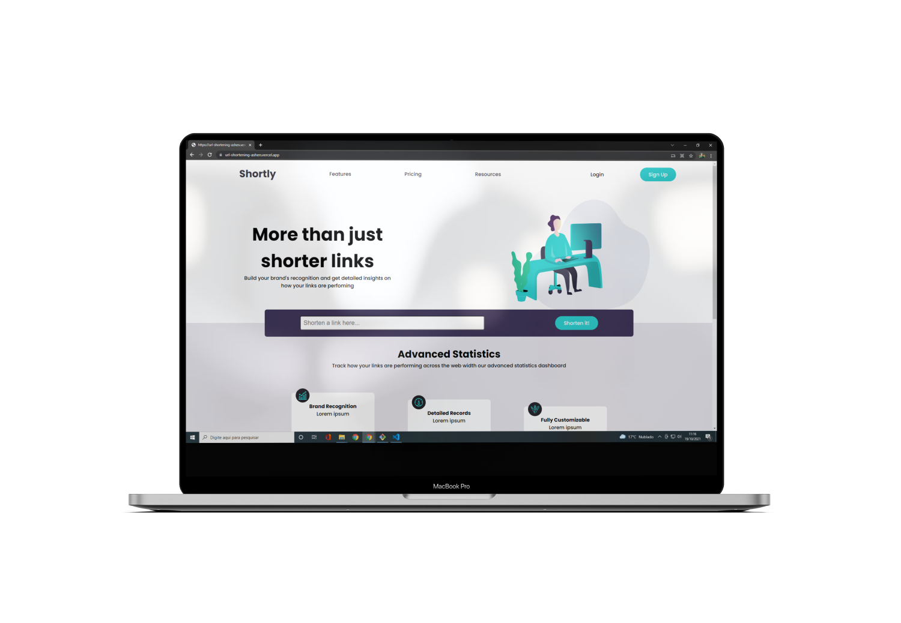

# URL Shortening

This is a URL shortening page. Based in a challenge of [Frontend Mentor](https://www.frontendmentor.io/challenges/url-shortening-api-landing-page-2ce3ob-G)

## Table of contents

- [URL Shortening](#url-shortening)
  - [Table of contents](#table-of-contents)
  - [Overview](#overview)
    - [The challenge](#the-challenge)
    - [Screnshot](#screnshot)
    - [Links](#links)
  - [My process](#my-process)
    - [Built with](#built-with)
    - [What I learn](#what-i-learn)
  - [Author](#author)
    - [Get in touch](#get-in-touch)

## Overview

### The challenge

Users should be able to:

- View the optimal layout for desktop screen size
- See hover states for all interactive elements on the page
- Shorten url using a external API

### Screnshot

### Links

-  Enjoy my project: [URL Shortening](https://url-shortening-ashen.vercel.app/)

## My process

### Built with

- HTML5
- CSS3
- Styled Components
- Javascript
- Next JS

### What I learn

  I put into practice my knowledge of HTML5 and CSS3 to develop this application. In addition, I put my previous knowledge of Javascript into practice. Improved skills in Next JS and Styled Components. 
  
## Author

### Get in touch
- Portfolio - [Gabriel Moura](https://gcmoura-portfolio.netlify.app/)
- Linkedin - [Gabriel Moura](https://www.linkedin.com/in/gabriel-moura-developer/)
- Github - [@GCMoura](https://github.com/GCMoura)
